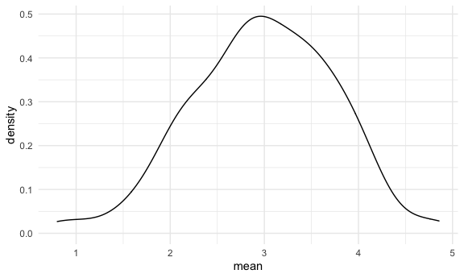

Simulation
================
Yuen
11/18/2021

## define the theme for all the ggplots!

``` r
library(tidyverse)
```

    ## ── Attaching packages ─────────────────────────────────────── tidyverse 1.3.1 ──

    ## ✓ ggplot2 3.3.5     ✓ purrr   0.3.4
    ## ✓ tibble  3.1.3     ✓ dplyr   1.0.7
    ## ✓ tidyr   1.1.3     ✓ stringr 1.4.0
    ## ✓ readr   2.1.0     ✓ forcats 0.5.1

    ## ── Conflicts ────────────────────────────────────────── tidyverse_conflicts() ──
    ## x dplyr::filter() masks stats::filter()
    ## x dplyr::lag()    masks stats::lag()

``` r
library(rvest)
```

    ## 
    ## Attaching package: 'rvest'

    ## The following object is masked from 'package:readr':
    ## 
    ##     guess_encoding

``` r
knitr::opts_chunk$set(
  fig.width = 6,
  fig.asp = 0.6,
  out.width = "90%"
)

theme_set(theme_minimal() + theme(legend.position = "bottom"))

options(
  ggplot2.continuous.color = "viridis",
  ggplot2.continuous.fill = "viridis"
)

scale_color.discrete = scale_color_viridis_d
scale_fill_discrete = scale_fill_viridis_d

#every time when set up the random numbers,
#give the same numbers each time
set.seed(1)
```

## Let’s simulate something

I have function

``` r
sim_mean_sd = function(samp_size, mu = 3, sigma = 4) {
  sim_data = 
    tibble(
      x = rnorm(samp_size, mean = mu, sd = sigma)
    )
  
  sim_data %>% 
    summarize(
      mean = mean(x),
      sd = sd(x)
    )
}
```

I can simulate by running this line

``` r
#everytime when we run this code, we're doing repeated sampling
sim_mean_sd(30)
```

    ## # A tibble: 1 × 2
    ##    mean    sd
    ##   <dbl> <dbl>
    ## 1  3.33  3.70

## Let’s simulate a lot

Let’s start with a for loop

``` r
output = vector("list", length = 100)

for (i in 1:100) {
  output[[i]] = sim_mean_sd(samp_size = 30)
}

bind_rows(output)
```

    ## # A tibble: 100 × 2
    ##     mean    sd
    ##    <dbl> <dbl>
    ##  1  3.53  3.18
    ##  2  3.44  3.84
    ##  3  3.45  3.53
    ##  4  1.68  3.69
    ##  5  3.95  4.22
    ##  6  3.27  4.34
    ##  7  2.05  4.05
    ##  8  3.10  3.72
    ##  9  3.55  4.11
    ## 10  3.87  3.79
    ## # … with 90 more rows

Let’s use a loop function!!!

``` r
simulation_results = 
  rerun(100,sim_mean_sd(samp_size = 30)) %>% 
    bind_rows()
```

Let’s look at results…

``` r
simulation_results %>% 
  ggplot(aes(x = mean)) + 
  geom_density()
```



``` r
simulation_results %>% 
  summarize(
    average_samp_mean = mean(mean),
    sd_samp_mean = sd(mean)
  )
```

    ## # A tibble: 1 × 2
    ##   average_samp_mean sd_samp_mean
    ##               <dbl>        <dbl>
    ## 1              2.98        0.756

``` r
simulation_results %>% 
  ggplot(aes(x = sd)) + geom_density()
```


## Let’s try other sample sizes

``` r
n_list = 
  list(
    "n = 30" = 30,
    "n = 60" = 60,
    "n = 120" = 120,
    "n = 240" = 240
  )

output = vector("list", length = 4)

#goal - output[[1]] = f(input[[1]])

#1 - this method is redundant
output[[1]] = rerun(100, sim_mean_sd(samp_size = n_list[[1]])) %>%  bind_rows()
output[[2]] = rerun(100, sim_mean_sd(samp_size = n_list[[2]])) %>%  bind_rows()
output[[3]] = rerun(100, sim_mean_sd(samp_size = n_list[[3]])) %>%  bind_rows()
output[[4]] = rerun(100, sim_mean_sd(samp_size = n_list[[4]])) %>%  bind_rows()


#2 - use a for lopp
for (i in 1:4){
  
  output[[i]] = 
    rerun(100, sim_mean_sd(samp_size = n_list[[i]])) %>% 
    bind_rows()
}
```

``` r
sim_results = 
  tibble(
    sample_size = c(30, 60, 120, 240)
  ) %>% 
    mutate(
      output_lists = map(.x = sample_size, ~ rerun(10, sim_mean_sd(.x))),
      estimate_df = map(output_lists, bind_rows)
    ) %>% 
    select(-output_lists) %>% 
    #expand the dfs
    unnest(estimate_df)
```

Do some data frame things

``` r
sim_results %>% 
  mutate(
    sample_size = str_c("n = ", sample_size),
    sample_size = fct_inorder(sample_size)
  ) %>% 
  ggplot(aes(x = sample_size, y = mean)) +
  geom_violin()
```


``` r
sim_results %>% 
  group_by(sample_size) %>% 
  summarize(
    avg_samp_mean = mean(mean),
    sd_samp_mean = sd(mean)
  )
```

    ## # A tibble: 4 × 3
    ##   sample_size avg_samp_mean sd_samp_mean
    ##         <dbl>         <dbl>        <dbl>
    ## 1          30          2.80        0.630
    ## 2          60          3.17        0.401
    ## 3         120          2.98        0.197
    ## 4         240          2.97        0.196
