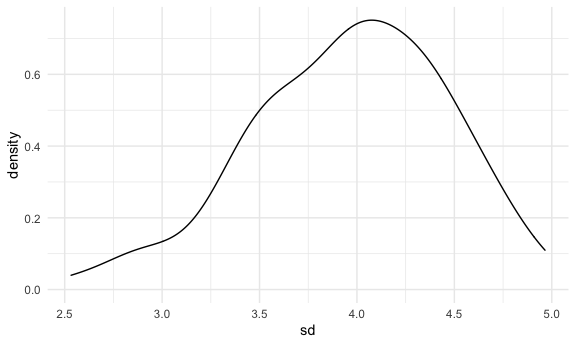

Simulation
================
Yuen
11/18/2021

## define the theme for all the ggplots!

``` r
library(tidyverse)
```

    ## ── Attaching packages ─────────────────────────────────────── tidyverse 1.3.1 ──

    ## ✓ ggplot2 3.3.5     ✓ purrr   0.3.4
    ## ✓ tibble  3.1.3     ✓ dplyr   1.0.7
    ## ✓ tidyr   1.1.3     ✓ stringr 1.4.0
    ## ✓ readr   2.1.0     ✓ forcats 0.5.1

    ## ── Conflicts ────────────────────────────────────────── tidyverse_conflicts() ──
    ## x dplyr::filter() masks stats::filter()
    ## x dplyr::lag()    masks stats::lag()

``` r
library(rvest)
```

    ## 
    ## Attaching package: 'rvest'

    ## The following object is masked from 'package:readr':
    ## 
    ##     guess_encoding

``` r
knitr::opts_chunk$set(
  fig.width = 6,
  fig.asp = 0.6,
  out.width = "90%"
)

theme_set(theme_minimal() + theme(legend.position = "bottom"))

options(
  ggplot2.continuous.color = "viridis",
  ggplot2.continuous.fill = "viridis"
)

scale_color.discrete = scale_color_viridis_d
scale_fill_discrete = scale_fill_viridis_d
```

## Let’s simulate something

I have function

``` r
sim_mean_sd = function(samp_size, mu = 3, sigma = 4) {
  sim_data = 
    tibble(
      x = rnorm(samp_size, mean = mu, sd = sigma)
    )
  
  sim_data %>% 
    summarize(
      mean = mean(x),
      sd = sd(x)
    )
}
```

I can simulate by running this line

``` r
#everytime when we run this code, we're doing repeated sampling
sim_mean_sd(30)
```

    ## # A tibble: 1 × 2
    ##    mean    sd
    ##   <dbl> <dbl>
    ## 1  3.63  4.42

## Let’s simulate a lot

Let’s start with a for loop

``` r
output = vector("list", length = 100)

for (i in 1:100) {
  output[[i]] = sim_mean_sd(samp_size = 30)
}

bind_rows(output)
```

    ## # A tibble: 100 × 2
    ##     mean    sd
    ##    <dbl> <dbl>
    ##  1  3.45  3.40
    ##  2  3.69  3.76
    ##  3  4.14  4.13
    ##  4  3.10  4.81
    ##  5  3.50  4.25
    ##  6  2.60  4.17
    ##  7  2.99  4.03
    ##  8  3.75  4.21
    ##  9  3.67  4.09
    ## 10  3.28  4.72
    ## # … with 90 more rows

Let’s use a loop function!!!

``` r
simulation_results = 
  rerun(100,sim_mean_sd(samp_size = 30)) %>% 
    bind_rows()
```

Let’s look at results…

``` r
simulation_results %>% 
  ggplot(aes(x = mean)) + 
  geom_density()
```


``` r
simulation_results %>% 
  summarize(
    average_samp_mean = mean(mean),
    sd_samp_mean = sd(mean)
  )
```

    ## # A tibble: 1 × 2
    ##   average_samp_mean sd_samp_mean
    ##               <dbl>        <dbl>
    ## 1              2.92        0.729

``` r
simulation_results %>% 
  ggplot(aes(x = sd)) + geom_density()
```


